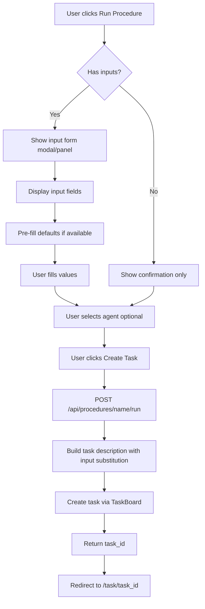

# ADR-012: Procedures Web UI

## Status
Accepted

## Context

The CLI has an SOP (Standard Operating Procedures) command that is not yet supported in the web UI. The SOP system allows users to define reusable workflows as YAML files that agents can follow. Currently, managing SOPs requires using the command line.

Users need the ability to:
1. View and manage procedures through the web interface
2. Create tasks from procedures with optional input field values
3. Understand what inputs a procedure requires before running it

### Existing SOP Data Model

SOPs are defined in YAML files in `.xpressai/sops/` with the following structure:

```yaml
name: Weekly Report
summary: Compile my weekly summary for the team
tools:
  - get_current_time
  - write_file

# Optional inputs - name/description pairs that act as variables
# Users provide values when running the procedure
inputs:
  - name: output_path
    context: The file path where the message will be written
    default: hello.txt  # Optional default value

outputs:
  - name: status
    context: SUCCESS if the file was written, FAIL otherwise

steps:
  - prompt: Get the current time
    tools:
      - get_current_time
  - prompt: Write a file with the message "The current time is: {current_time}"
    tools:
      - write_file
    inputs:
      - output_path  # Reference to input variable
```

**Key Point**: Inputs are optional name/description pairs that serve as variables. When a step references an input, the user-provided value is substituted into the step's context.

### Existing Backend

The [`SOPManager`](../../src/xpressai/tasks/sop.py:204) class provides:
- `list_sops()` - List all SOPs from the sops directory
- `get(name)` - Get an SOP by name or filename
- `create(sop)` - Create a new SOP file
- `delete(name)` - Delete an SOP file

## Decision

We will add a Procedures page to the web UI that allows viewing, managing, and executing SOPs.

### Navigation

Add "Procedures" to the navigation bar in [`base.html`](../../src/xpressai/web/templates/base.html:14):

```html
<nav>
    <a href="/" class="active">Dashboard</a>
    <a href="/agents" class="active">Agents</a>
    <a href="/tasks" class="active">Tasks</a>
    <a href="/procedures" class="active">Procedures</a>
    <a href="/memory" class="active">Memory</a>
    <a href="/logs" class="active">Logs</a>
</nav>
```

### Routes

#### Page Routes

| Method | Path | Description |
|--------|------|-------------|
| GET | `/procedures` | Main procedures page with list and detail view |

#### API Routes

| Method | Path | Description |
|--------|------|-------------|
| GET | `/api/procedures` | List all procedures |
| GET | `/api/procedures/{name}` | Get procedure details |
| POST | `/api/procedures` | Create new procedure from template |
| DELETE | `/api/procedures/{name}` | Delete a procedure |
| POST | `/api/procedures/{name}/run` | Create a task from procedure with input values |

#### HTMX Partials

| Method | Path | Description |
|--------|------|-------------|
| GET | `/partials/procedures/list` | Procedures list HTML |
| GET | `/partials/procedures/{name}` | Procedure detail panel HTML |
| GET | `/partials/procedures/{name}/run-form` | Input form for running procedure |

### Template Structure

The procedures page uses a two-column layout similar to the zettelkasten browser:

```
┌─────────────────────────────────────────────────────────────────┐
│ Procedures                                    [+ New Procedure] │
├──────────────────────────┬──────────────────────────────────────┤
│  Procedure List          │  Procedure Detail                    │
│  ────────────────────    │  ─────────────────                   │
│  ┌────────────────────┐  │  Name: Weekly Report                 │
│  │ Weekly Report      │  │  Summary: Compile weekly...          │
│  │ 2 inputs, 3 steps  │  │                                      │
│  └────────────────────┘  │  Tools: get_current_time, write_file │
│  ┌────────────────────┐  │                                      │
│  │ Data Backup        │  │  Inputs:                             │
│  │ 1 input, 4 steps   │  │  • output_path                       │
│  └────────────────────┘  │    The file path where...            │
│                          │    Default: hello.txt                │
│                          │                                      │
│                          │  Steps:                              │
│                          │  1. Get the current time             │
│                          │  2. Write file with message...       │
│                          │     Uses: output_path                │
│                          │                                      │
│                          │  [Run Procedure] [Delete]            │
└──────────────────────────┴──────────────────────────────────────┘
```

### Run Procedure Flow

When a user clicks "Run Procedure":



#### Input Form

For procedures with inputs, display a form with:

```html
<form hx-post="/api/procedures/{name}/run">
    <h3>Run: {procedure.name}</h3>
    <p>{procedure.summary}</p>
    
    <!-- For each input -->
    <div class="input-field">
        <label for="input_{name}">{input.name}</label>
        <p class="help-text">{input.context}</p>
        <input type="text" 
               name="{input.name}" 
               value="{input.default or ''}"
               placeholder="Enter value...">
    </div>
    
    <!-- Agent selection -->
    <div class="input-field">
        <label>Assign to Agent</label>
        <select name="agent_id">
            <option value="">Unassigned</option>
            
            <option value="{{ agent.name }}">{{ agent.name }}</option>
            
        </select>
    </div>
    
    <button type="submit">Create Task</button>
</form>
```

### Task Creation

When `/api/procedures/{name}/run` is called:

1. Load the SOP by name
2. Validate all required inputs are provided
3. Substitute input values into step prompts where referenced
4. Create task with formatted description:

```markdown
## Procedure: Weekly Report

Compile my weekly summary for the team

### Inputs
| Name | Value |
|------|-------|
| output_path | report.txt |

### Steps
1. Get the current time
   - Tools: get_current_time

2. Write a file with the message "The current time is: {current_time}"
   - Tools: write_file
   - Uses input: output_path = report.txt

### Expected Outputs
- status: SUCCESS if the file was written, FAIL otherwise
```

5. Store SOP metadata in task context:
```python
task = await task_board.create_task(
    title=f"SOP: {sop.name}",
    description=formatted_description,
    agent_id=agent_id,
    context={
        "sop_name": sop.name,
        "sop_inputs": {"output_path": "report.txt"},
    }
)
```

### Backend Implementation

Add to [`app.py`](../../src/xpressai/web/app.py):

```python
from xpressai.tasks.sop import SOPManager

# In create_app():

@app.get("/procedures", response_class=HTMLResponse)
async def procedures_page(request: Request):
    """Procedures page."""
    agents = []
    if _runtime:
        agents = await _runtime.list_agents()
    if templates:
        return templates.TemplateResponse(
            "procedures.html", 
            {"request": request, "active": "procedures", "agents": agents}
        )
    return HTMLResponse("<h1>Procedures - Templates not installed</h1>")

@app.get("/api/procedures")
async def list_procedures():
    """List all procedures."""
    manager = SOPManager()
    sops = manager.list_sops()
    return {
        "procedures": [
            {
                "name": sop.name,
                "summary": sop.summary,
                "input_count": len(sop.inputs),
                "step_count": len(sop.steps),
            }
            for sop in sops
        ]
    }

@app.get("/api/procedures/{name}")
async def get_procedure(name: str):
    """Get procedure details."""
    manager = SOPManager()
    sop = manager.get(name)
    if not sop:
        raise HTTPException(status_code=404, detail="Procedure not found")
    
    return {
        "name": sop.name,
        "summary": sop.summary,
        "tools": sop.tools,
        "inputs": [
            {"name": inp.name, "context": inp.context, "default": inp.default}
            for inp in sop.inputs
        ],
        "outputs": [
            {"name": out.name, "context": out.context}
            for out in sop.outputs
        ],
        "steps": [
            {
                "prompt": step.prompt,
                "tools": step.tools,
                "inputs": step.inputs,
            }
            for step in sop.steps
        ],
    }

@app.post("/api/procedures/{name}/run")
async def run_procedure(name: str, request: Request):
    """Create a task from a procedure."""
    if not _runtime or not _runtime.task_board:
        raise HTTPException(status_code=503, detail="Runtime not available")
    
    manager = SOPManager()
    sop = manager.get(name)
    if not sop:
        raise HTTPException(status_code=404, detail="Procedure not found")
    
    # Get form data
    form = await request.form()
    agent_id = form.get("agent_id") or None
    
    # Collect input values
    input_values = {}
    for inp in sop.inputs:
        value = form.get(inp.name)
        if value:
            input_values[inp.name] = value
        elif inp.default:
            input_values[inp.name] = inp.default
    
    # Format task description
    description = format_sop_description(sop, input_values)
    
    # Create task
    task = await _runtime.task_board.create_task(
        title=f"SOP: {sop.name}",
        description=description,
        agent_id=agent_id,
    )
    
    return {"status": "ok", "task_id": task.id}
```

## Consequences

### Positive
- Users can manage SOPs without command line access
- Visual representation of procedure structure
- Easy task creation from templates with input forms
- Consistent UI patterns with existing pages

### Negative
- Adds more routes and templates to maintain
- SOP editing not included in initial implementation (view only)

### Implementation Notes

1. Start with read-only view of procedures
2. Add run functionality with input form
3. Future: Add in-browser YAML editing
4. Future: Add procedure execution history tracking

## Related ADRs
- [ADR-007: HTMX Web UI](ADR-007-htmx-web-ui.md) - Web UI architecture
- [ADR-009: Task and SOP System](ADR-009-task-sop-system.md) - SOP system design
